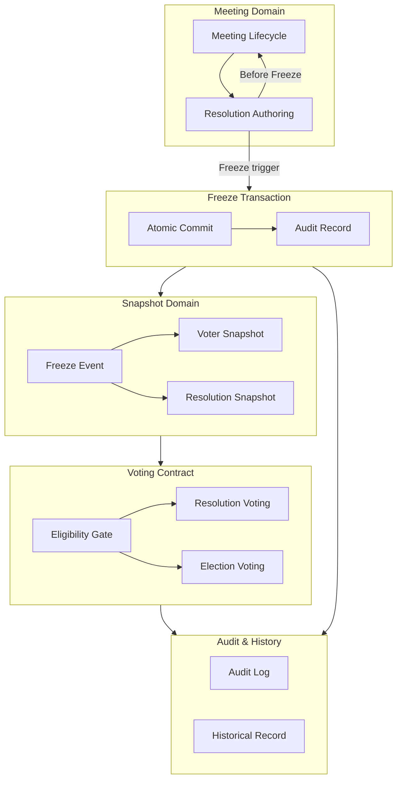

# M2-S3 — Snapshot Freeze Engineering Blueprint

| Field | Value |
|-------|-------|
| **Identifier** | M2-S3 |
| **Title** | Snapshot Freeze Engineering Blueprint |
| **Type** | Engineering Blueprint |
| **Status** | **Draft** |
| **Milestone** | M2 — Meeting Resolution Authoring |
| **Slice** | S3 |
| **Release** | FR2 — Governance Release |
| **Authority** | [`CDR-001`](../cdr/CDR-001-Voting-Eligibility-Decision.md) |
| **Engineering standards** | [`CES-001`](CES-001-Engineering-Standard.md) · [`CES-002`](CES-002-Database-Engineering-Standard.md) · [`CES-003`](CES-003-Frontend-Engineering-Standard.md) |
| **Implementation authority** | **Not Authorized** |
| **Production effect** | **None** |

**First Engineering Blueprint** under Governance Framework Version 1.0 (Baseline Locked).

> **Document class:** This is an **Engineering Blueprint** — it describes **how** approved constitutional contracts shall be engineered. It is **not** an implementation document, requirements document, RFC, migration plan, or authorization.

---

## 1. Purpose

Snapshot Freeze exists to establish a **constitutional boundary** between Meeting authority and Voting authority. Its purpose is **constitutional protection**, not feature expansion.

| Protection goal | Engineering meaning |
|-----------------|---------------------|
| **Immutable voting state** | After Freeze, the legal voting instrument and voter roll cannot drift with live edits |
| **Eligibility preservation** | Who may vote is fixed at Freeze and auditable thereafter |
| **Historical integrity** | Ballots bind to frozen content and frozen eligibility — not mutable live rows |
| **Auditability** | Freeze is a discrete, attributable event with traceable before/after state |
| **Constitutional boundary protection** | Meeting owns authoring before Freeze; Voting owns formal ballot submission after Freeze |

Without Snapshot Freeze as an atomic legal event, owners cannot know which constitutional record determines eligibility, and the platform cannot defend voting outcomes under membership change or resolution edit.

---

## 2. Scope

### Included

| Area | Blueprint coverage |
|------|-------------------|
| Snapshot domain | Voter roll freeze, resolution instrument freeze, freeze event semantics |
| Freeze transaction | Atomicity, failure handling, audit generation, recovery concept |
| Voting contract | Unified eligibility for resolution and election paths post-freeze |
| Owner Requisitioned SGM lifecycle | 7-day authoring → freeze → 7-day formal voting (CDR-001 Option A) |
| Automatic freeze authority | Server/database primary; client fallback only |
| CITM traceability | All engineering items mapped to constitutional sources |
| Migration and verification **strategy** | Approach only — no scripts |
| Implementation prerequisites | Gates before authorized engineering |

### Not included

| Excluded item | Reason |
|---------------|--------|
| UI redesign | Out of slice constitutional scope |
| Email templates | Not part of freeze boundary |
| Meeting creation workflow | Precedes snapshot domain; unchanged by this blueprint |
| General meeting module | Broader module; only Owner Voting freeze contract addressed |
| Governance authoring retirement (Slice 1) | Separate M2 slice |
| Meeting resolution CRUD authoring (Slice 2) | Prerequisite slice; not redefined here |
| Execution / accountability layers | Out of FR2 / M2 Slice 3 scope |
| SQL, RPC signatures, React components, migration files | Reserved for Implementation Authorization phase |

---

## 3. Constitutional authority

This blueprint implements **only** the following approved sources. It does **not** reinterpret them.

| Source | Role in this blueprint |
|--------|------------------------|
| **Founding Constitution** | Trust, transparency, democratic integrity — voting must be defensible |
| [`RC010-A`](../rc/RC010-A-Snapshot-Constitutional-Boundary.md) | Snapshot Freeze = Meeting → Voting handoff; dual snapshot (voter + resolution) at one freeze event |
| [`RC010-B`](../rc/RC010-B-Production-Freeze-Contract-Recovery.md) | Production freeze facts — input only |
| [`RC010-C`](../investigations/RC010-C-Voting-Eligibility-Contract.md) | Production eligibility facts — input only |
| [`CDR-001`](../cdr/CDR-001-Voting-Eligibility-Decision.md) | **Binding target** — MODEL B voter roll, Option A lifecycle, immutability, unified contract |

**Rule:** Production behavior documented in RC010-B and RC010-C is **evidence**, not authority. The engineering target is CDR-001.

---

## 4. Engineering dependencies

| Dependency | Application to M2-S3 |
|------------|------------------------|
| [`CES-001`](CES-001-Engineering-Standard.md) | Slice structure, CITM, Constitutional Compliance, implementation discipline |
| [`CES-002`](CES-002-Database-Engineering-Standard.md) | Snapshot, audit, migration, RPC discipline — design level only in this blueprint |
| [`CES-003`](CES-003-Frontend-Engineering-Standard.md) | Route/guard/state alignment; client freeze as fallback only |
| [`DOCUMENT-GOVERNANCE.md`](../DOCUMENT-GOVERNANCE.md) | Authority order, Framework Boundary Rule, Versioning Policy |
| [`GOVERNANCE-FREEZE-v1.0.md`](../GOVERNANCE-FREEZE-v1.0.md) | Governance Framework v1.0 — Baseline Locked |
| [`Engineering-Implementation-Era-v1.0.md`](../eras/Engineering-Implementation-Era-v1.0.md) | Implementation is primary activity; framework is stable |
| [`Slice-Design-Template.md`](templates/Slice-Design-Template.md) | Structural reference (this blueprint extends template sections for domain depth) |

**Prerequisite milestones:** M2 Slice 2 (Meeting formal resolution authoring) must remain intact; Slice 3 adds freeze boundary without reversing Slice 2 ownership model.

---

## 5. Current production

Facts recovered in RC010-B and RC010-C. **No solutions proposed in this section.**

### Legacy

| Legacy element | Observation |
|----------------|-------------|
| Historical `submit_owner_vote` migration path | Earlier migration used snapshot-based eligibility; superseded in production |
| Legacy OV open/window path | Non-V3 meetings may still use OV `status = open` and `[voting_opens_at, voting_closes_at]` |
| Dual mental models | Election path already snapshot-based; resolution path is live-membership-based |

### Current

| Behavior | Production fact |
|----------|-----------------|
| **Freeze RPC** | `freeze_owner_vote_snapshot` builds voter snapshot from live `property_members`; sets `snapshot_frozen_at`; allows re-freeze rebuild |
| **Resolution submit** | `submit_owner_vote` uses **live** `property_members`; does **not** require `snapshot_frozen_at` |
| **Election submit** | `submit_owner_election_ballot` requires **`owner_vote_voter_snapshot`** eligibility |
| **V3 window** | Council `scheduled_at` + **14-day unified** submit window; bypasses OV open/freeze gates |
| **Auto-freeze** | **Client-triggered** (`MeetingDetail` useEffect) — unreliable without page visit |
| **Resolution binding** | Votes bind to **mutable** `owner_vote_resolutions` row identity |
| **UI vs RPC** | UI often gates on snapshot; RPC for resolution votes uses live membership — **divergence** |

### Known limitations

| Limitation | Classification |
|------------|----------------|
| Resolution and election use different eligibility contracts | Known Constitutional Implementation Gap |
| Freeze is not a hard gate for resolution voting | Known Constitutional Implementation Gap |
| No immutable frozen resolution instrument in repo model | Known Constitutional Implementation Gap |
| Re-freeze can rebuild snapshot | Known Constitutional Implementation Gap |
| Automatic freeze depends on client visit | Known Constitutional Implementation Gap |
| V3 14-day window ≠ CDR-001 7+freeze+7 for Owner Requisitioned SGM | Known Constitutional Implementation Gap |

---

## 6. Target architecture

Engineering architecture for Snapshot Freeze under CDR-001 and RC010-A.



### Layer responsibilities

| Layer | Responsibility |
|-------|----------------|
| **Meeting** | Owns formal resolution content, order, and method **until** Freeze completes |
| **Snapshot Domain** | Holds immutable voter roll and immutable resolution instrument bound to one freeze event |
| **Freeze Transaction** | Single atomic transition: live → frozen; sets legal boundary timestamp |
| **Voting Contract** | Authorizes ballots only against frozen eligibility and frozen instrument |
| **Audit** | Records freeze and vote events with actor, timestamp, correlation |
| **History** | Preserves legacy ballots and prior freeze attempts without rewriting |

**Authority shift:** Meeting → Voting occurs **at completed Freeze**, not at meeting creation or council schedule alone.

---

## 7. Constitutional Implementation Traceability Matrix (CITM)

Every engineering section in this blueprint maps to one or more CITM rows. **No CITM row → not authorized at implementation.**

| Engineering Item | Constitution Source | CDR | Target State | Slice | Implementation Status |
|------------------|---------------------|-----|--------------|-------|------------------------|
| Voter snapshot as sole legal roll | RC010-A | CDR-001 §1, D1 | `owner_vote_voter_snapshot` after Freeze | M2-S3 | **Pending** |
| Resolution snapshot / frozen instrument | RC010-A | CDR-001 §9 | Immutable resolution content at freeze | M2-S3 | **Pending** |
| Unified eligibility (resolution + election) | RC010-A, RC010-C | CDR-001 §10 | Same snapshot contract both paths | M2-S3 | **Pending** |
| Freeze atomic event | RC010-A | CDR-001 §3 | Single transaction binds voter + resolution + timestamp | M2-S3 | **Pending** |
| Snapshot immutability post-freeze | RC010-A | CDR-001 §4 | No silent rebuild; authorized correction only | M2-S3 | **Pending** |
| Owner Req. SGM 7+freeze+7 lifecycle | RC010-B facts | CDR-001 §2, D2 | Authoring window → freeze → formal voting window | M2-S3 | **Pending** |
| Server-primary automatic freeze Day 7 | RC010-B facts | CDR-001 §6, §8 | Scheduler/database primary; client fallback | M2-S3 | **Pending** |
| Manual council early freeze | RC010-A | CDR-001 §7 | Permitted during authoring period | M2-S3 | **Pending** |
| Resolution vote submit gate | RC010-C | CDR-001 D1 | Require freeze complete + snapshot row | M2-S3 | **Pending** |
| Election vote submit alignment | RC010-C | CDR-001 §10 | Same gate semantics as resolution | M2-S3 | **Pending** |
| Vote binds to frozen instrument | RC010-A | CDR-001 §9 | Not mutable resolution row identity alone | M2-S3 | **Pending** |
| Freeze audit record | RC010-A, CES-002 | CDR-001 §3 | Exactly one audit per successful freeze | M2-S3 | **Pending** |
| UI eligibility display alignment | CES-003 | CDR-001 §5 | UI matches RPC/database contract | M2-S3 | **Pending** |
| Legacy meeting compatibility | RC010-B | CDR-001 | Documented coexistence during migration | M2-S3 | **Pending** |
| Correction / reissue process | CDR-001 §5 | CDR-001 §5 | Separate authorized constitutional process | M2-S3 | **Pending** |

---

## 8. Constitutional invariants

Engineering **contracts** for M2-S3. Violation at implementation is a constitutional defect.

| ID | Invariant |
|----|-----------|
| **INV-1** | Snapshot becomes **immutable** after successful Freeze |
| **INV-2** | Post-freeze eligibility derives **only** from the frozen voter snapshot — not live membership |
| **INV-3** | Votes are **never rewritten**; ballot records are append-only or idempotent-update with audit |
| **INV-4** | Freeze is **atomic** — voter snapshot, resolution snapshot, and freeze timestamp commit together or not at all |
| **INV-5** | A successful Freeze generates **exactly one** primary audit record for the freeze event |
| **INV-6** | **Legacy history** is preserved; migration does not delete or silently alter historical ballots |
| **INV-7** | **Meeting resolutions freeze together** as one instrument set bound to the same freeze event (per RC010-A dual snapshot) |
| **INV-8** | **Snapshot identity** is globally unique per meeting freeze event — reissue requires authorized correction, not silent rebuild |
| **INV-9** | **UI, RPC, and persistence** enforce the same eligibility and freeze gates (CDR-001 principle 5) |
| **INV-10** | **Automatic freeze** at Day 7 for Owner Requisitioned SGM is server/database-primary |

These invariants are **design contracts**. They do not authorize implementation.

---

## 9. Snapshot domain design

Conceptual domain model — **not** SQL tables.

### Entities

| Entity | Description |
|--------|-------------|
| **Meeting** | Owner vote meeting bound to property; carries lifecycle phase (authoring / frozen / voting / closed) |
| **Freeze Event** | Immutable marker that authoring ended and voting instrument is fixed |
| **Voter Snapshot** | Legal roll of eligible voters (user/unit binding) at freeze |
| **Resolution Snapshot** | Immutable set of formal motions (content, order, method, threshold) at freeze |
| **Voting Phase** | Post-freeze period during which formal ballots are accepted |
| **Ballot** | Vote record bound to frozen resolution identity and snapshot eligibility |

### Relationships

```
Meeting 1 — 0..1 Active Freeze Event (successful)
Freeze Event 1 — 1 Voter Snapshot
Freeze Event 1 — 1 Resolution Snapshot
Resolution Snapshot 1 — N Formal Motions (frozen content)
Voter Snapshot 1 — N Voter Entries
Ballot N — 1 Frozen Motion + 1 Voter Entry (eligibility proof)
```

### Ownership

| Phase | Domain owner |
|-------|--------------|
| Before Freeze | **Meeting** owns resolution authoring and agenda |
| At Freeze | **Snapshot Domain** receives authoritative copy |
| After Freeze | **Voting Contract** owns ballot authorization |

### Lifecycle

```
Authoring → (Manual or Automatic Freeze) → Frozen → Formal Voting → Closed
```

Authoring duration for Owner Requisitioned SGM: up to **7 days** from meeting start. Formal voting: **7 days** after freeze.

### Responsibilities

| Component | Responsibility |
|-----------|----------------|
| Meeting domain | Prevent post-freeze authoring edits to frozen instrument |
| Snapshot domain | Serve read-only legal roll and instrument to voting |
| Voting contract | Reject pre-freeze submits and post-freeze ineligible voters |
| Audit | Correlate freeze event id across freeze and vote records |

---

## 10. Freeze transaction design

Conceptual transaction — **no** implementation details.

### Atomicity

Freeze transaction **must** commit atomically:

1. Voter snapshot materialized from live membership **at freeze instant**
2. Resolution snapshot materialized from meeting-owned formal resolutions **at freeze instant**
3. Freeze timestamp recorded on meeting
4. Meeting phase transitions to **frozen / voting-eligible**

Partial completion is **invalid** — rollback entire transaction.

### Failure handling

| Failure class | Engineering response |
|---------------|------------------------|
| Membership read failure | Abort; meeting remains in authoring |
| Resolution incomplete / invalid | Abort; council notified; no partial freeze |
| Concurrent freeze attempt | Single winner; others receive idempotent success or explicit conflict |
| Scheduler misfire | Retry with audit; client fallback may trigger recovery path only |

### Rollback concept

If freeze transaction aborts, **no** snapshot rows persist and **no** freeze timestamp is set. Meeting remains in authoring state.

### Audit generation

Exactly **one** primary freeze audit entry per successful freeze: actor (or system), timestamp, meeting correlation id, snapshot version identity.

### Recovery concept

| Scenario | Recovery |
|----------|----------|
| Missed Day-7 server freeze | Server scheduler retry; client fallback as secondary |
| Partial legacy state | Investigation-gated manual correction via future authorized process — not silent rebuild |
| Authorized reissue | Separate CDR-governed correction — new freeze event identity; preserves prior history |

### Sequence

```
Trigger (manual council | server Day-7 | client fallback)
    → Validate meeting in authoring
    → Build voter snapshot candidate
    → Build resolution snapshot candidate
    → Begin transaction
    → Persist snapshots + freeze timestamp + phase
    → Write audit
    → Commit
    → Emit voting phase window (7 days formal)
```

---

## 11. Voting contract

Conceptual contract — **no** RPC design.

### Resolution voting

| Principle | Contract |
|-----------|------------|
| Precondition | Freeze **complete**; formal voting window **open** |
| Eligibility | Matching row in **frozen voter snapshot** for meeting |
| Instrument | Ballot references **frozen resolution identity**, not live editable row |
| Rejection | No snapshot row → not eligible; before freeze → not accepted |
| Consistency | Same rules as election path |

### Election voting

| Principle | Contract |
|-----------|------------|
| Precondition | Freeze **complete** |
| Eligibility | **Same** frozen voter snapshot as resolution path (CDR-001 §10) |
| Instrument | Election choices bound to frozen election instrument |
| Alignment | Remove production split where election uses snapshot and resolution uses live membership |

### Eligibility validation

Validation order (conceptual):

1. Authenticated user
2. Property / meeting scope
3. **Freeze complete**
4. **Formal voting window** (workflow-specific)
5. **Snapshot eligibility row** exists
6. Motion/instrument id belongs to **frozen set**

Live membership checks **only** at freeze construction — **never** as post-freeze ballot gate.

### Snapshot binding

Every ballot carries implicit or explicit binding to:

- Freeze event identity
- Frozen voter entry
- Frozen motion/instrument identity

### Validation principles

| Principle | Rule |
|-----------|------|
| **Fail closed** | Ambiguous eligibility → reject |
| **Single roll** | One legal voter roll per meeting post-freeze |
| **No drift** | Post-freeze membership change does not alter eligibility |
| **Cross-layer parity** | UI disabled state matches server rejection reason class |

---

## 12. Migration strategy

Strategy only — **no** SQL.

### Legacy compatibility

| Approach | Intent |
|----------|--------|
| **Phased meeting-type rollout** | Owner Requisitioned SGM first (CDR-001 Option A); other workflows per RC010-B matrix |
| **Dual-path coexistence (temporary)** | Legacy meetings complete under documented legacy rules until migrated or closed |
| **Read-only legacy history** | Historical ballots remain queryable; not retroactively rebound |

### Incremental deployment

1. Deploy freeze transaction and snapshot immutability semantics
2. Align resolution submit contract to snapshot (closes largest gap)
3. Deploy server-primary scheduler for Day-7 freeze
4. Align UI gates and messaging to unified contract
5. Deprecate client-only auto-freeze as primary mechanism

### Rollback philosophy

Rollback returns to **prior production contract** only via explicit deployment rollback — not partial semantic rollback. Each phase must define **forward-only** recovery if rollback is infeasible.

### Production coexistence

During transition, engineering must document which meetings are **legacy-contract** vs **CDR-001-contract** to avoid mixed interpretation. No meeting should simultaneously enforce contradictory eligibility models.

---

## 13. Verification strategy

### Engineering verification

| Area | Verification intent |
|------|---------------------|
| Freeze atomicity | Attempt forced failure mid-transaction — no partial state |
| Immutability | Post-freeze mutation attempts rejected at all layers |
| Eligibility unity | Resolution and election paths reject identical negative cases |
| Scheduler | Day-7 freeze fires without client page visit |
| Idempotency | Repeated freeze trigger does not corrupt snapshot |

### Regression

| Regression target | Intent |
|-------------------|--------|
| Slice 2 resolution authoring | Pre-freeze CRUD still works |
| Entry / login / join flows | Unaffected (domain-entry-flow-lock) |
| Election path | Remains functional; aligned not broken |
| Legacy non-V3 meetings | Documented behavior preserved or explicitly migrated |

### Constitution compliance

| Source | Verification |
|--------|--------------|
| CDR-001 ten binding points | Checklist per point with evidence |
| RC010-A dual snapshot | Voter + resolution at one event |
| CITM | Every deployed engineering item has passing row |

### Audit validation

Verify freeze audit **once per event**; verify vote audit includes freeze correlation id.

### Acceptance evidence

| Evidence type | Purpose |
|---------------|---------|
| SQL validation queries | Schema and RPC state proof |
| Integration test output | Cross-layer behavior |
| Manual QA scripts | Owner Requisitioned SGM 7+freeze+7 journey |
| Compliance table | CES-001 Constitutional Compliance section completed |

---

## 14. Implementation prerequisites

All items **Pending** until Implementation Authorization.

| Prerequisite | Status | Notes |
|--------------|--------|-------|
| **Implementation Authorization** document | **Pending** | Separate record required |
| **This blueprint** reviewed and promoted from Draft | **Pending** | Design gate |
| **Migration review** | **Pending** | Strategy → authorized migration plan |
| **Engineering review** | **Pending** | CES-001/002/003 compliance sign-off |
| **Verification plan** | **Pending** | §13 expanded with test cases |
| **CITM complete** for all deployed items | **Pending** | No orphan engineering artifacts |
| **Rollback / coexistence plan** approved | **Pending** | Legacy meeting matrix |
| **Release readiness** (FR2 / M2 gate) | **Pending** | Milestone acceptance criteria |
| **Council / governance sign-off** | **Pending** | Per DOCUMENT-GOVERNANCE approval rules |

---

## 15. Authorization

**This Engineering Blueprint authorizes engineering design only.**

**Implementation is NOT authorized.**

Implementation requires a separate **Implementation Authorization** document issued under Governance Framework Version 1.0, following:

```
RC → Investigation → CDR → Engineering Blueprint → Implementation Authorization → Engineering → Verification → Release
```

No application code, database schema, SQL, RPC, React, Edge Functions, migrations, or production behavior may change based on this document alone.

---

**Standards:** [`CES-001`](CES-001-Engineering-Standard.md) · [`CES-002`](CES-002-Database-Engineering-Standard.md) · [`CES-003`](CES-003-Frontend-Engineering-Standard.md)

**Constitutional decision:** [`CDR-001`](../cdr/CDR-001-Voting-Eligibility-Decision.md)

**Governance:** [`DOCUMENT-GOVERNANCE.md`](../DOCUMENT-GOVERNANCE.md) · [`GOVERNANCE-FREEZE-v1.0.md`](../GOVERNANCE-FREEZE-v1.0.md)
