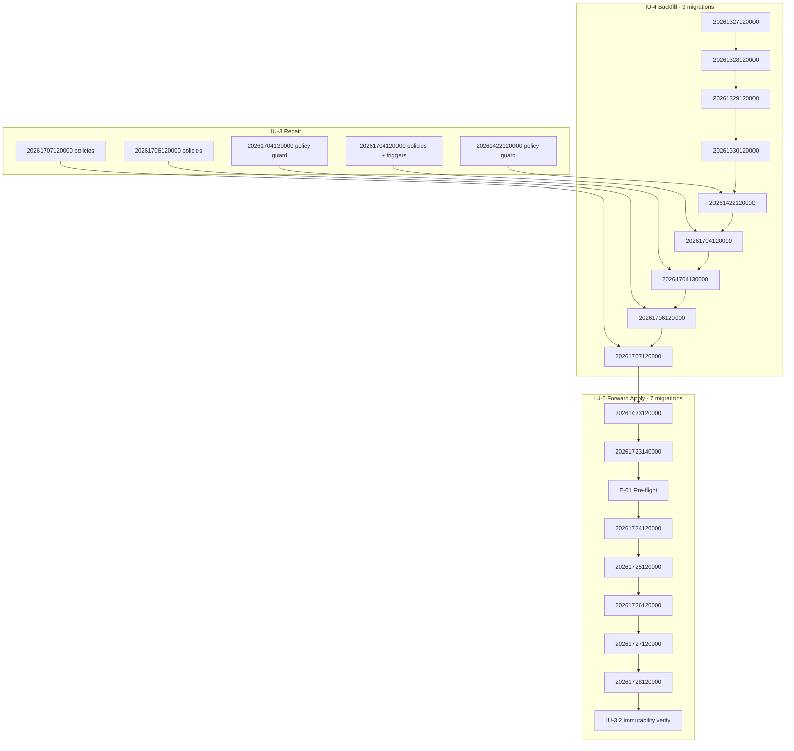

# RC-011 IU-2 — Drift Classification & Execution Plan

| Field | Value |
|-------|-------|
| **Program** | RC-011 Migration History Reconciliation |
| **Implementation Unit** | **IU-2** — Drift Classification & Reconciliation Plan |
| **Mode** | Planning (read-only — no DDL, no history mutation, no db push) |
| **Authoritative Source** | [`RC-011-Implementation-Plan.md`](RC-011-Implementation-Plan.md) **Revision v1.0** |
| **Primary Input** | [`RC-011-IU-1-Inventory.md`](RC-011-IU-1-Inventory.md) |
| **Linked Supabase project** | `wqohkxtqozscmwfrryfl` |
| **Classification date** | 2026-07-30 |
| **Pending migrations classified** | **16** (`20261327120000` → `20261728120000`) |

> **Document class:** Final classification verdicts and ordered execution plan for IU-3, IU-4, and IU-5. This document authorizes engineering decisions but does **not** implement them.

---

## 1. Classification summary

| Verdict | Count | Migrations |
|---------|------:|------------|
| **BACKFILL_OK** | 4 | `20261327120000`, `20261328120000`, `20261329120000`, `20261330120000` |
| **REPAIR_REQUIRED** | 5 | `20261422120000`, `20261704120000`, `20261704130000`, `20261706120000`, `20261707120000` |
| **APPLY_REQUIRED** | 7 | `20261423120000`, `20261723140000`, `20261724120000`, `20261725120000`, `20261726120000`, `20261727120000`, `20261728120000` |
| **INVESTIGATE** | 0 | — |

**Revision from Implementation Plan §4.1 preliminary verdicts:** `20261330120000` upgraded from REPAIR_REQUIRED → **BACKFILL_OK** (IU-1 confirms full catalog match; migration uses idempotent `DROP TRIGGER IF EXISTS` + `CREATE OR REPLACE FUNCTION`; no statement-collision entries).

---

## 2. Per-migration classification table

| Version | Filename | Primary verdict | Owning IU |
|---------|----------|-----------------|-----------|
| `20261327120000` | `council_action_manager_bridge` | BACKFILL_OK | IU-4 |
| `20261328120000` | `manager_feedback_rollup` | BACKFILL_OK | IU-4 |
| `20261329120000` | `council_review_queue` | BACKFILL_OK | IU-4 |
| `20261330120000` | `council_actions_created_audit_trigger` | BACKFILL_OK | IU-4 |
| `20261422120000` | `sgm_pause_email_deliveries` | REPAIR_REQUIRED | IU-3 → IU-4 |
| `20261423120000` | `sgm_pause_delivery_sending_claim` | APPLY_REQUIRED | IU-5 |
| `20261704120000` | `governance_matters` | REPAIR_REQUIRED | IU-3 → IU-4 |
| `20261704130000` | `governance_matter_cda` | REPAIR_REQUIRED | IU-3 → IU-4 |
| `20261706120000` | `community_resolutions` | REPAIR_REQUIRED | IU-3 → IU-4 |
| `20261707120000` | `governance_matter_subscriptions` | REPAIR_REQUIRED | IU-3 → IU-4 |
| `20261723140000` | `meeting_formal_resolution_authoring` | APPLY_REQUIRED | IU-5 |
| `20261724120000` | `e01_iu11_snapshot_domain_schema` | APPLY_REQUIRED | IU-5 |
| `20261725120000` | `e01_iu21_freeze_event_identity` | APPLY_REQUIRED | IU-5 |
| `20261726120000` | `e01_iu22_voter_snapshot_immutability` | APPLY_REQUIRED | IU-5 |
| `20261727120000` | `e01_iu31_resolution_snapshot_foundation` | APPLY_REQUIRED | IU-5 |
| `20261728120000` | `e01_iu32_resolution_snapshot_immutability` | APPLY_REQUIRED | IU-5 |

---

## 3. Per-migration classification records

---

### 3.1 — `20261327120000` · `council_action_manager_bridge.sql`

| Field | Value |
|-------|-------|
| **IU-1 summary** | All bridge columns, indexes, FKs, and `manager_tasks_task_type_check` present. No missing, extra, or partial objects. |
| **Primary classification** | **BACKFILL_OK** |
| **Engineering rationale** | Live catalog matches repository migration intent. Migration uses `ADD COLUMN IF NOT EXISTS` and `CREATE INDEX IF NOT EXISTS`. No statement collisions. |
| **Blocking objects / discrepancies** | None. |
| **Required action** | Insert history row in IU-4 without schema execution. |
| **Required verification evidence** | Post-backfill: `schema_migrations` row exists; column/index/FK spot-check matches IU-1 §5.1. |
| **Rollback requirement** | Remove erroneous history row only (IU-4 rollback per Implementation Plan §8). |
| **Owning IU** | IU-4 Backfill |
| **Dependencies** | None beyond DB head `20261326120000`. First in sequence. |

---

### 3.2 — `20261328120000` · `manager_feedback_rollup.sql`

| Field | Value |
|-------|-------|
| **IU-1 summary** | All three feedback columns and `manager_feedback_by` FK present. |
| **Primary classification** | **BACKFILL_OK** |
| **Engineering rationale** | Full catalog equivalence. Idempotent column adds. |
| **Blocking objects / discrepancies** | None. |
| **Required action** | IU-4 history backfill. |
| **Required verification evidence** | Post-backfill: history row + column spot-check. |
| **Rollback requirement** | Remove history row only. |
| **Owning IU** | IU-4 Backfill |
| **Dependencies** | `20261327120000` backfilled. |

---

### 3.3 — `20261329120000` · `council_review_queue.sql`

| Field | Value |
|-------|-------|
| **IU-1 summary** | All review columns, `council_actions_review_status_check`, and FK present. |
| **Primary classification** | **BACKFILL_OK** |
| **Engineering rationale** | Full catalog equivalence. Conditional constraint uses existence guard in migration. |
| **Blocking objects / discrepancies** | None. |
| **Required action** | IU-4 history backfill. |
| **Required verification evidence** | Post-backfill: history row + constraint spot-check. |
| **Rollback requirement** | Remove history row only. |
| **Owning IU** | IU-4 Backfill |
| **Dependencies** | `20261328120000` backfilled. |

---

### 3.4 — `20261330120000` · `council_actions_created_audit_trigger.sql`

| Field | Value |
|-------|-------|
| **IU-1 summary** | Both audit functions and both triggers present on `council_actions`. Migration already idempotent (`DROP TRIGGER IF EXISTS`, `CREATE OR REPLACE FUNCTION`). |
| **Primary classification** | **BACKFILL_OK** |
| **Engineering rationale** | Catalog equivalent. No statement-collision entries in IU-1 §4. Preliminary REPAIR_REQUIRED verdict superseded — OOB objects exist but migration re-apply would succeed idempotently. |
| **Blocking objects / discrepancies** | None for backfill or re-apply. |
| **Required action** | IU-4 history backfill. |
| **Required verification evidence** | Post-backfill: history row; `pg_trigger` / `pg_proc` spot-check; optional re-apply dry-run passes. |
| **Rollback requirement** | Remove history row only. |
| **Owning IU** | IU-4 Backfill |
| **Dependencies** | `20261329120000` backfilled. |

---

### 3.5 — `20261422120000` · `sgm_pause_email_deliveries.sql`

| Field | Value |
|-------|-------|
| **IU-1 summary** | Table, indexes, RLS, policy, constraints all present. Status CHECK matches this migration (`sent`, `failed` only). One statement collision: policy `sgm_pause_email_deliveries_select_staff`. |
| **Primary classification** | **REPAIR_REQUIRED** |
| **Engineering rationale** | Catalog equivalent for this migration's scope, but bare `CREATE POLICY` would fail on sequential re-apply / `db push` after history backfill. Repair must make policy creation idempotent before history is recorded. |
| **Blocking objects / discrepancies** | Statement collision: `sgm_pause_email_deliveries_select_staff` (IU-1 §4). |
| **Required action** | IU-3: repair artifact guards policy creation (`DO $$ … IF NOT EXISTS (pg_policies) …`). IU-4: backfill after re-apply simulation passes. |
| **Required verification evidence** | IU-3: re-apply dry-run of repaired migration succeeds; policy unchanged in catalog. IU-4: history row + table/policy spot-check. |
| **Rollback requirement** | IU-3: restore pre-repair policy definition if repair modified SQL path; IU-4: remove history row. |
| **Owning IU** | IU-3 Repair → IU-4 Backfill |
| **Dependencies** | `20261330120000` backfilled. Blocks `20261423120000` apply until backfilled (table prerequisite). |

---

### 3.6 — `20261423120000` · `sgm_pause_delivery_sending_claim.sql`

| Field | Value |
|-------|-------|
| **IU-1 summary** | `claim_sgm_pause_email_delivery` function **absent**. Status CHECK partial — lacks `'sending'`. Table dependency present from prior migration. |
| **Primary classification** | **APPLY_REQUIRED** |
| **Engineering rationale** | Core migration deliverables (function, expanded CHECK, service_role grant) are missing. Cannot backfill — would create false history. Must forward-apply after `20261422120000` is in history. |
| **Blocking objects / discrepancies** | Missing: `claim_sgm_pause_email_delivery`, EXECUTE grant. Partial: `sgm_pause_email_deliveries_status_check` (no `sending`). |
| **Required action** | IU-5: forward apply via normal migration execution. History row recorded by apply, not IU-4 insert. |
| **Required verification evidence** | Function exists; CHECK includes `sending`; `has_function_privilege(service_role, …, EXECUTE)`; claim RPC smoke test optional. |
| **Rollback requirement** | Per CES-009 downgrade: drop function; restore prior status CHECK (`sent`, `failed` only). |
| **Owning IU** | IU-5 Forward Apply |
| **Dependencies** | `20261422120000` backfilled in IU-4. Must precede governance OOB backfill block in strict version order. |

---

### 3.7 — `20261704120000` · `governance_matters.sql`

| Field | Value |
|-------|-------|
| **IU-1 summary** | All four tables, indexes, functions, triggers, policies, grants present. Eleven statement collisions: seven policies + four triggers (no `DROP IF EXISTS`). |
| **Primary classification** | **REPAIR_REQUIRED** |
| **Engineering rationale** | Full OOB catalog match, but eleven non-idempotent `CREATE` statements would fail on re-apply. Repair required before history backfill to prevent future `db push` failure. |
| **Blocking objects / discrepancies** | Policies: `gm_select_tenant`, `gm_insert_council`, `gm_update_council`, `gm_rev_select_tenant`, `gm_comment_select_tenant`, `gm_comment_insert_member`, `gm_mod_select_staff`. Triggers: `trg_governance_matter_touch`, `trg_governance_matter_revision_insert`, `trg_governance_matter_revision_update`, `trg_governance_matter_comment_immutable`. |
| **Required action** | IU-3: repair artifact adds `DROP TRIGGER IF EXISTS` / guarded `CREATE POLICY` for all eleven objects. IU-4: backfill after re-apply simulation. |
| **Required verification evidence** | IU-3: full migration re-apply dry-run passes; catalog object count unchanged. IU-4: history row. |
| **Rollback requirement** | IU-3: catalog snapshot per Implementation Plan §8; IU-4: remove history row. |
| **Owning IU** | IU-3 Repair → IU-4 Backfill |
| **Dependencies** | `20261423120000` applied (strict version order). |

---

### 3.8 — `20261704130000` · `governance_matter_cda.sql`

| Field | Value |
|-------|-------|
| **IU-1 summary** | Table, indexes, function, trigger present. Trigger uses `DROP IF EXISTS`. One policy collision: `gm_cda_select_tenant`. |
| **Primary classification** | **REPAIR_REQUIRED** |
| **Engineering rationale** | Catalog equivalent except policy collision blocks idempotent re-apply. |
| **Blocking objects / discrepancies** | Policy `gm_cda_select_tenant` (IU-1 §4). |
| **Required action** | IU-3: guard policy creation. IU-4: backfill. |
| **Required verification evidence** | Re-apply dry-run passes; policy present. |
| **Rollback requirement** | Remove history row; revert repair if needed. |
| **Owning IU** | IU-3 Repair → IU-4 Backfill |
| **Dependencies** | `20261704120000` backfilled. |

---

### 3.9 — `20261706120000` · `community_resolutions.sql`

| Field | Value |
|-------|-------|
| **IU-1 summary** | Both tables, bridge columns, indexes, functions, triggers (with `DROP IF EXISTS`), policies all present. Four policy collisions. |
| **Primary classification** | **REPAIR_REQUIRED** |
| **Engineering rationale** | Full catalog match; four bare `CREATE POLICY` statements block re-apply. |
| **Blocking objects / discrepancies** | Policies: `cr_select_tenant`, `cr_insert_council`, `cr_update_council`, `cr_rev_select_tenant`. |
| **Required action** | IU-3: guard four policies. IU-4: backfill. |
| **Required verification evidence** | Re-apply dry-run passes. |
| **Rollback requirement** | Remove history row; catalog snapshot. |
| **Owning IU** | IU-3 Repair → IU-4 Backfill |
| **Dependencies** | `20261704130000` backfilled. |

---

### 3.10 — `20261707120000` · `governance_matter_subscriptions.sql`

| Field | Value |
|-------|-------|
| **IU-1 summary** | Table, indexes, unique constraint, three policies present. Three policy collisions. Closes RC-009 OOB debt (Implementation Plan §9). |
| **Primary classification** | **REPAIR_REQUIRED** |
| **Engineering rationale** | Full catalog match; three bare `CREATE POLICY` statements block re-apply. |
| **Blocking objects / discrepancies** | Policies: `gms_select_own`, `gms_insert_own_member`, `gms_delete_own`. |
| **Required action** | IU-3: guard three policies. IU-4: backfill. |
| **Required verification evidence** | Re-apply dry-run passes; RC-009 OOB closure confirmed in backfill log. |
| **Rollback requirement** | Remove history row. |
| **Owning IU** | IU-3 Repair → IU-4 Backfill |
| **Dependencies** | `20261706120000` backfilled. Last migration in IU-4 backfill block. |

---

### 3.11 — `20261723140000` · `meeting_formal_resolution_authoring.sql`

| Field | Value |
|-------|-------|
| **IU-1 summary** | All expected objects missing: formal resolution columns, audit table, indexes, policies. No collisions (catalog absent). |
| **Primary classification** | **APPLY_REQUIRED** |
| **Engineering rationale** | Greenfield schema. Normal forward apply. |
| **Blocking objects / discrepancies** | Entire migration scope absent. |
| **Required action** | IU-5 forward apply. |
| **Required verification evidence** | Columns on `meeting_agenda_items`; `meeting_formal_resolution_audit` table + policies exist. |
| **Rollback requirement** | Drop audit table; drop columns; drop policies per CES-009. |
| **Owning IU** | IU-5 Forward Apply |
| **Dependencies** | IU-4 block complete through `20261707120000`. Prerequisite for E-01 `source_formal_resolution_version` column reference in IU-3.1. |

---

### 3.12 — `20261724120000` · `e01_iu11_snapshot_domain_schema.sql` · **Special Review**

| Field | Value |
|-------|-------|
| **IU-1 summary** | `owner_vote_voter_snapshot` present (44 rows, 9 columns match). `snapshot_frozen_at` present. FKs and RLS present. **Missing:** four migration-named indexes. **Extra:** production indexes (`idx_owner_vote_snapshot_*`, `uq_owner_vote_snapshot_meeting_unit`), `user_id` FK, production policies (`owner_vote_snapshot_owner_select`, `owner_vote_snapshot_staff_select`). |
| **Primary classification** | **APPLY_REQUIRED** |
| **Engineering rationale** | **Not BACKFILL_OK:** four expected indexes absent — catalog not verified equivalent; backfill would record false completion. **Not REPAIR_REQUIRED:** discrepancies are incomplete index set plus intentional policy preservation, not statement collisions. Migration file explicitly: (1) `CREATE INDEX IF NOT EXISTS` for missing indexes — safe additive apply; (2) `CREATE POLICY ovvs_select_tenant_member` only `IF NOT EXISTS (pg_policies)` — production policies correctly preserved; (3) `CREATE TABLE IF NOT EXISTS` — no-op on existing 44-row table; (4) conditional FK blocks skip when orphans would block. Forward apply achieves remaining intent without data loss or policy replacement. Per Implementation Plan §4.3, E-01 chain owned by IU-5; history recorded via apply. |
| **Blocking objects / discrepancies** | Missing indexes: `idx_owner_vote_voter_snapshot_meeting_id`, `_meeting_user`, `_meeting_eligible`, `_meeting_unit_norm`. Production index/policy naming divergence is **accepted** per migration idempotent design — not blocking. |
| **Required action** | IU-5: guarded forward apply. Pre-flight: [`E-01-IU-1.1C-Deployment-Readiness.md`](E-01-IU-1.1C-Deployment-Readiness.md). Post-apply: confirm 44 rows retained; four indexes created; production policies unchanged. |
| **Required verification evidence** | Row count ≥ 44, zero orphan FKs; four new indexes in `pg_indexes`; production policies still present; `snapshot_frozen_at` column exists. |
| **Rollback requirement** | Drop four added indexes only; do not drop table or policies; document row count before/after. |
| **Owning IU** | IU-5 Forward Apply |
| **Dependencies** | `20261723140000` applied. First migration in E-01 bundle. |

---

### 3.13 — `20261725120000` · `e01_iu21_freeze_event_identity.sql`

| Field | Value |
|-------|-------|
| **IU-1 summary** | All objects absent: `owner_vote_freeze_events` table, `freeze_event_id` column, indexes, FKs, policy. |
| **Primary classification** | **APPLY_REQUIRED** |
| **Engineering rationale** | Greenfield E-01 Phase 2. Nullable `freeze_event_id` preserves 44 legacy rows. |
| **Blocking objects / discrepancies** | Entire scope absent. |
| **Required action** | IU-5 forward apply after IU-1.1C pre-flight. |
| **Required verification evidence** | Table exists; column nullable on `owner_vote_voter_snapshot`; legacy rows have `freeze_event_id IS NULL`. |
| **Rollback requirement** | Drop column; drop table; CES-009 downgrade. |
| **Owning IU** | IU-5 Forward Apply |
| **Dependencies** | `20261724120000` applied. |

---

### 3.14 — `20261726120000` · `e01_iu22_voter_snapshot_immutability.sql`

| Field | Value |
|-------|-------|
| **IU-1 summary** | Immutability function and trigger absent. Prerequisite `freeze_event_id` absent. |
| **Primary classification** | **APPLY_REQUIRED** |
| **Engineering rationale** | Greenfield trigger; uses `DROP TRIGGER IF EXISTS` — idempotent. No effect on legacy rows (`WHEN OLD.freeze_event_id IS NOT NULL`). |
| **Blocking objects / discrepancies** | Function + trigger absent. |
| **Required action** | IU-5 forward apply. |
| **Required verification evidence** | Trigger exists; legacy UPDATE/DELETE on NULL `freeze_event_id` still permitted (negative test deferred to §6.F). |
| **Rollback requirement** | Drop trigger and function. |
| **Owning IU** | IU-5 Forward Apply |
| **Dependencies** | `20261725120000` applied (**strict** — trigger references `freeze_event_id`). |

---

### 3.15 — `20261727120000` · `e01_iu31_resolution_snapshot_foundation.sql`

| Field | Value |
|-------|-------|
| **IU-1 summary** | Both Phase 3 tables and all indexes/FKs/policies absent. |
| **Primary classification** | **APPLY_REQUIRED** |
| **Engineering rationale** | Greenfield E-01 Phase 3 foundation. Empty tables expected post-apply. |
| **Blocking objects / discrepancies** | Entire scope absent. |
| **Required action** | IU-5 forward apply. |
| **Required verification evidence** | Both tables exist; RLS enabled; conditional policies created. |
| **Rollback requirement** | Drop both tables (empty). |
| **Owning IU** | IU-5 Forward Apply |
| **Dependencies** | `20261726120000` applied; `owner_vote_freeze_events` must exist for FK targets. |

---

### 3.16 — `20261728120000` · `e01_iu32_resolution_snapshot_immutability.sql`

| Field | Value |
|-------|-------|
| **IU-1 summary** | Both immutability functions and triggers absent. Prerequisite tables absent. |
| **Primary classification** | **APPLY_REQUIRED** |
| **Engineering rationale** | Greenfield immutability hooks. Idempotent trigger pattern. Closes E-01 schema chain. |
| **Blocking objects / discrepancies** | Functions + triggers absent. |
| **Required action** | IU-5 forward apply. |
| **Required verification evidence** | Triggers exist; IU-3.2 immutability negative SQL (§6.F) passes on seeded event-linked rows. |
| **Rollback requirement** | Drop triggers and functions. |
| **Owning IU** | IU-5 Forward Apply |
| **Dependencies** | `20261727120000` applied (**strict**). Final migration — DB head must equal repo head on completion. |

---

## 4. Special review assessments

### 4.1 — `20261423120000` (SGM pause claim RPC)

| Assessment | Detail |
|------------|--------|
| **IU-1 facts** | Function absent; CHECK lacks `'sending'`; prerequisite table from `20261422120000` present. |
| **Verdict** | **APPLY_REQUIRED** |
| **Rationale** | Partial catalog cannot be backfilled. BF-001 atomic claim requires function + expanded CHECK. Must apply in IU-5 after `20261422120000` history exists. |
| **Risk if misclassified as BACKFILL_OK** | History would claim RPC deployed; SGM pause email claim path would fail at runtime. |

### 4.2 — `20261724120000` (production voter snapshot)

| Option | Assessment |
|--------|------------|
| **BACKFILL_OK** | **Rejected.** Four migration indexes missing. Backfill would falsely mark migration complete without index alignment. |
| **REPAIR_REQUIRED** | **Rejected as primary.** No statement collisions; production policies are intentionally preserved by migration guard. Index gap is resolved by the migration file itself via `CREATE INDEX IF NOT EXISTS` — same outcome as forward apply, not a separate repair artifact. |
| **APPLY_REQUIRED** | **Selected.** Partial catalog requires migration execution to complete index set. Idempotent apply safe for 44 existing rows. History via apply (IU-5), not IU-4 insert. Production policies retained by design. |

### 4.3 — Statement-collision register (18 entries)

| # | Migration | Object | Collision type | Resolution path | Post-resolution action |
|---|-----------|--------|----------------|-----------------|------------------------|
| 1 | `20261422120000` | `sgm_pause_email_deliveries_select_staff` | Policy | IU-3 repair: guarded `CREATE POLICY` | Verified IU-4 backfill |
| 2 | `20261704120000` | `gm_select_tenant` | Policy | IU-3 repair | Verified IU-4 backfill |
| 3 | `20261704120000` | `gm_insert_council` | Policy | IU-3 repair | Verified IU-4 backfill |
| 4 | `20261704120000` | `gm_update_council` | Policy | IU-3 repair | Verified IU-4 backfill |
| 5 | `20261704120000` | `gm_rev_select_tenant` | Policy | IU-3 repair | Verified IU-4 backfill |
| 6 | `20261704120000` | `gm_comment_select_tenant` | Policy | IU-3 repair | Verified IU-4 backfill |
| 7 | `20261704120000` | `gm_comment_insert_member` | Policy | IU-3 repair | Verified IU-4 backfill |
| 8 | `20261704120000` | `gm_mod_select_staff` | Policy | IU-3 repair | Verified IU-4 backfill |
| 9 | `20261704120000` | `trg_governance_matter_touch` | Trigger | IU-3 repair: `DROP TRIGGER IF EXISTS` | Verified IU-4 backfill |
| 10 | `20261704120000` | `trg_governance_matter_revision_insert` | Trigger | IU-3 repair | Verified IU-4 backfill |
| 11 | `20261704120000` | `trg_governance_matter_revision_update` | Trigger | IU-3 repair | Verified IU-4 backfill |
| 12 | `20261704120000` | `trg_governance_matter_comment_immutable` | Trigger | IU-3 repair | Verified IU-4 backfill |
| 13 | `20261704130000` | `gm_cda_select_tenant` | Policy | IU-3 repair | Verified IU-4 backfill |
| 14 | `20261706120000` | `cr_select_tenant` | Policy | IU-3 repair | Verified IU-4 backfill |
| 15 | `20261706120000` | `cr_insert_council` | Policy | IU-3 repair | Verified IU-4 backfill |
| 16 | `20261706120000` | `cr_update_council` | Policy | IU-3 repair | Verified IU-4 backfill |
| 17 | `20261706120000` | `cr_rev_select_tenant` | Policy | IU-3 repair | Verified IU-4 backfill |
| 18 | `20261707120000` | `gms_select_own` | Policy | IU-3 repair | Verified IU-4 backfill |
| 19 | `20261707120000` | `gms_insert_own_member` | Policy | IU-3 repair | Verified IU-4 backfill |
| 20 | `20261707120000` | `gms_delete_own` | Policy | IU-3 repair | Verified IU-4 backfill |

**Note:** IU-1 §4 lists 18 collision entries across 5 migrations (items 1–20 above include three `gms_*` policies counted as one migration group). All require **IU-3 repair** then **verified IU-4 backfill** — not guarded forward apply (catalog already complete).

**Non-collisions (no IU-3 action):** `20261723140000` policies absent — IU-5 greenfield apply. E-01 migrations use idempotent forms — IU-5 guarded apply.

### 4.4 — E-01 Phase 2–3 dependency chain

| Migration | Verdict | Strict dependency | Ordering constraint |
|-----------|---------|-------------------|---------------------|
| `20261724120000` IU-1.1 | APPLY_REQUIRED | `20261723140000` | E-01 bundle entry; pre-flight required |
| `20261725120000` IU-2.1 | APPLY_REQUIRED | `20261724120000` | Adds `freeze_event_id` column |
| `20261726120000` IU-2.2 | APPLY_REQUIRED | `20261725120000` | Trigger `WHEN (OLD.freeze_event_id IS NOT NULL)` |
| `20261727120000` IU-3.1 | APPLY_REQUIRED | `20261726120000` | FK to `owner_vote_freeze_events` |
| `20261728120000` IU-3.2 | APPLY_REQUIRED | `20261727120000` | Triggers on Phase 3 tables |

**Confirmed:** All five remain **APPLY_REQUIRED**. No E-01 migration may be backfilled in IU-4. Sequential IU-5 apply only.

---

## 5. Ordered reconciliation execution plan

### Phase A — Investigations

| Step | Action | Status |
|------|--------|--------|
| A.1 | Resolve any **INVESTIGATE** verdicts | **N/A** — zero INVESTIGATE verdicts |

### Phase B — Blocking drift repair (IU-3)

Execute **before** IU-4 backfill for REPAIR_REQUIRED migrations. Single repair artifact or scoped patches per Implementation Plan §4.2.

| Step | Migration | Repair scope |
|------|-----------|--------------|
| B.1 | `20261422120000` | Guard policy `sgm_pause_email_deliveries_select_staff` |
| B.2 | `20261704120000` | Guard 7 policies + add `DROP TRIGGER IF EXISTS` for 4 triggers |
| B.3 | `20261704130000` | Guard policy `gm_cda_select_tenant` |
| B.4 | `20261706120000` | Guard 4 `cr_*` policies |
| B.5 | `20261707120000` | Guard 3 `gms_*` policies |

**IU-3 exit gate:** Re-apply dry-run passes for all five repaired migrations; no duplicate-object errors.

**Rollback readiness:** Catalog export for policies/triggers in repair scope (Implementation Plan §8).

### Phase C — History backfill (IU-4)

Insert history rows **only** for BACKFILL_OK and repaired REPAIR_REQUIRED migrations. **Strict version order.**

| Step | Version | Verdict | Method |
|------|---------|---------|--------|
| C.1 | `20261327120000` | BACKFILL_OK | History insert |
| C.2 | `20261328120000` | BACKFILL_OK | History insert |
| C.3 | `20261329120000` | BACKFILL_OK | History insert |
| C.4 | `20261330120000` | BACKFILL_OK | History insert |
| C.5 | `20261422120000` | REPAIR_REQUIRED | History insert (post B.1) |
| C.6 | `20261704120000` | REPAIR_REQUIRED | History insert (post B.2) |
| C.7 | `20261704130000` | REPAIR_REQUIRED | History insert (post B.3) |
| C.8 | `20261706120000` | REPAIR_REQUIRED | History insert (post B.4) |
| C.9 | `20261707120000` | REPAIR_REQUIRED | History insert (post B.5) |

**IU-4 exit gate:** Nine history rows present; each paired with IU-1 evidence; `db push` dry-run from C.9 head shows next pending = `20261423120000`.

**Do not backfill:** `20261423120000`, `20261723140000`, or any E-01 migration (`20261724120000`–`20261728120000`).

### Phase D — Greenfield forward apply (IU-5)

Normal migration execution. History recorded by apply mechanism.

| Step | Version | Verdict | Notes |
|------|---------|---------|-------|
| D.1 | `20261423120000` | APPLY_REQUIRED | SGM claim RPC + status CHECK |
| D.2 | `20261723140000` | APPLY_REQUIRED | Formal resolution authoring |
| D.3 | `20261724120000` | APPLY_REQUIRED | E-01 IU-1.1 — idempotent on 44-row table |
| D.4 | `20261725120000` | APPLY_REQUIRED | E-01 IU-2.1 — freeze event identity |
| D.5 | `20261726120000` | APPLY_REQUIRED | E-01 IU-2.2 — voter immutability |
| D.6 | `20261727120000` | APPLY_REQUIRED | E-01 IU-3.1 — resolution snapshot foundation |
| D.7 | `20261728120000` | APPLY_REQUIRED | E-01 IU-3.2 — resolution immutability |

**IU-5 exit gate:** DB head = `20261728120000` = repo head.

### Phase E — E-01 pre-flight (within IU-5)

Execute [`E-01-IU-1.1C-Deployment-Readiness.md`](E-01-IU-1.1C-Deployment-Readiness.md) **before** step D.3.

| Check | Timing |
|-------|--------|
| Linked project confirmed | Before D.3 |
| `owner_vote_voter_snapshot` row count + orphan FK check | Before D.3 |
| Rollback plan documented | Before D.3 |
| Post-apply row count ≥ pre-apply | After D.3 |

### Phase F — IU-3.2 database verification (within IU-5)

After D.7, execute immutability negative SQL from [`E-01-IU-3.2-Completion.md`](E-01-IU-3.2-Completion.md) §7 against seeded event-linked fixture rows.

| Test | Expected |
|------|----------|
| UPDATE `owner_vote_voter_snapshot` where `freeze_event_id IS NOT NULL` | ERROR (IU-2.2) |
| UPDATE `owner_vote_resolution_snapshot` where `freeze_event_id IS NOT NULL` | ERROR (IU-3.2) |
| UPDATE `owner_vote_frozen_motions` where `freeze_event_id IS NOT NULL` | ERROR (IU-3.2) |
| Legacy rows `freeze_event_id IS NULL` | UPDATE/DELETE still permitted |

---

## 6. Dependency diagram



---

## 7. Open investigations

**None.** All 16 pending migrations received a primary verdict other than INVESTIGATE.

---

## 8. IU-3 repair artifact guidance (non-binding implementation hint)

IU-3 **shall** produce idempotent repair scoped to §4.3 collisions. Recommended pattern:

```sql
-- Policy guard pattern (representative)
DO $$
BEGIN
  IF NOT EXISTS (
    SELECT 1 FROM pg_policies
    WHERE schemaname = 'public' AND tablename = '<table>' AND policyname = '<name>'
  ) THEN
    CREATE POLICY "<name>" ...;
  END IF;
END $$;
```

Repair may be implemented as: (a) new repo migration(s) prepended before affected versions, or (b) authorized runbook amending migration files in place — decision deferred to IU-3.

---

## Document control

| Field | Value |
|-------|-------|
| **Standard** | CES-010 |
| **Authoritative for** | RC-011 IU-3, IU-4, IU-5 execution |
| **Supersedes** | Implementation Plan §4.1 preliminary verdicts (where noted) |
| **Input** | [`RC-011-IU-1-Inventory.md`](RC-011-IU-1-Inventory.md) |

**Unblocks:** RC-011 IU-3 entry (rollback readiness required per Implementation Plan §8)
